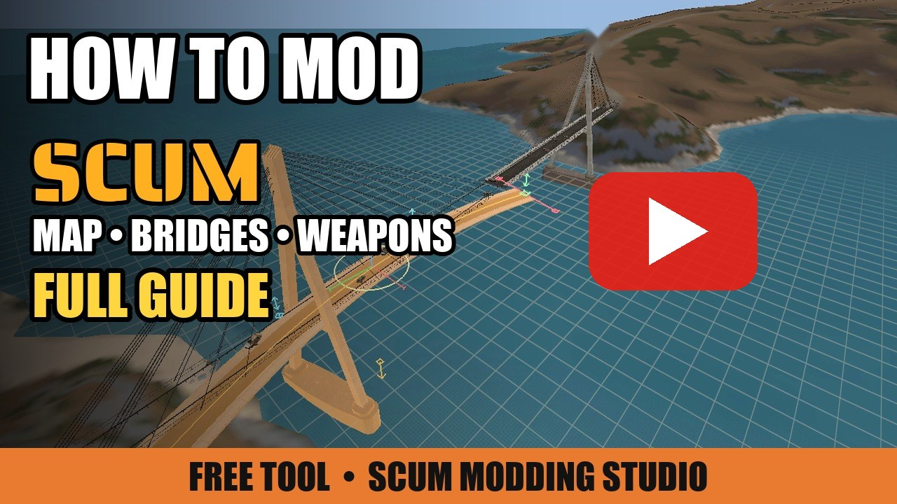
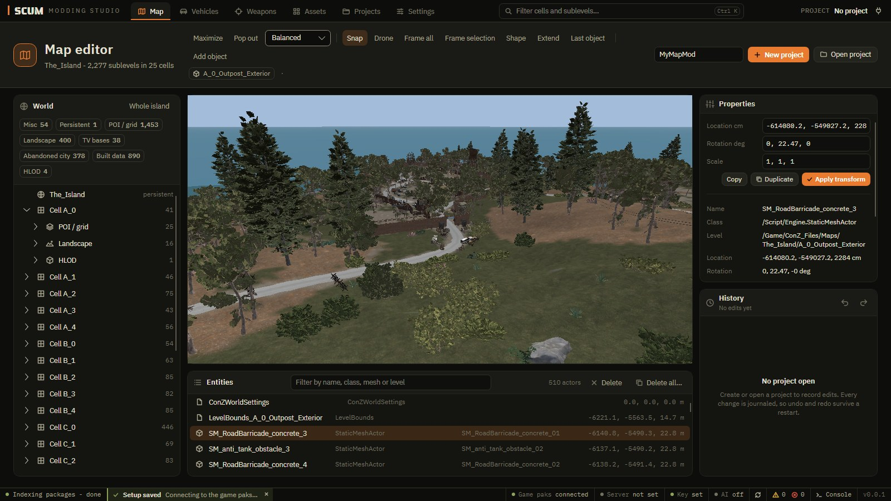
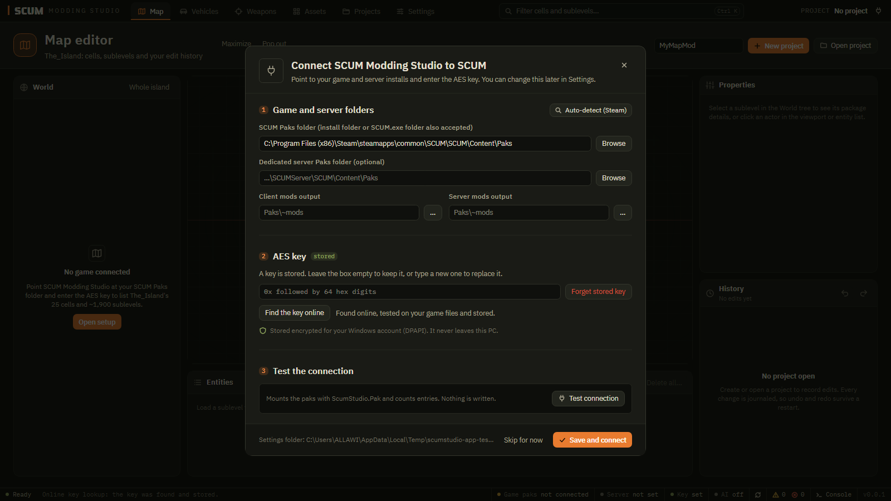
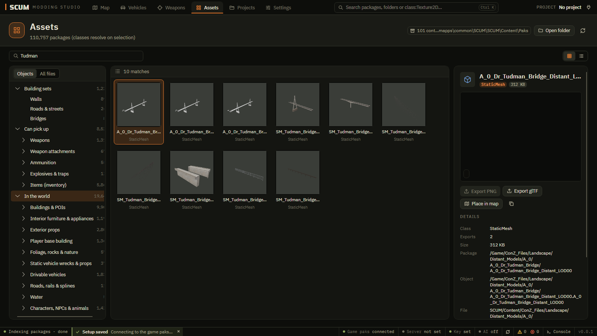
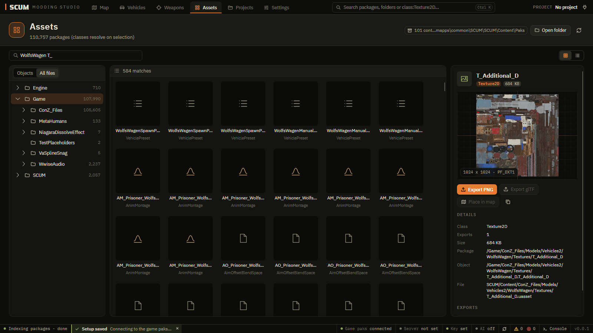
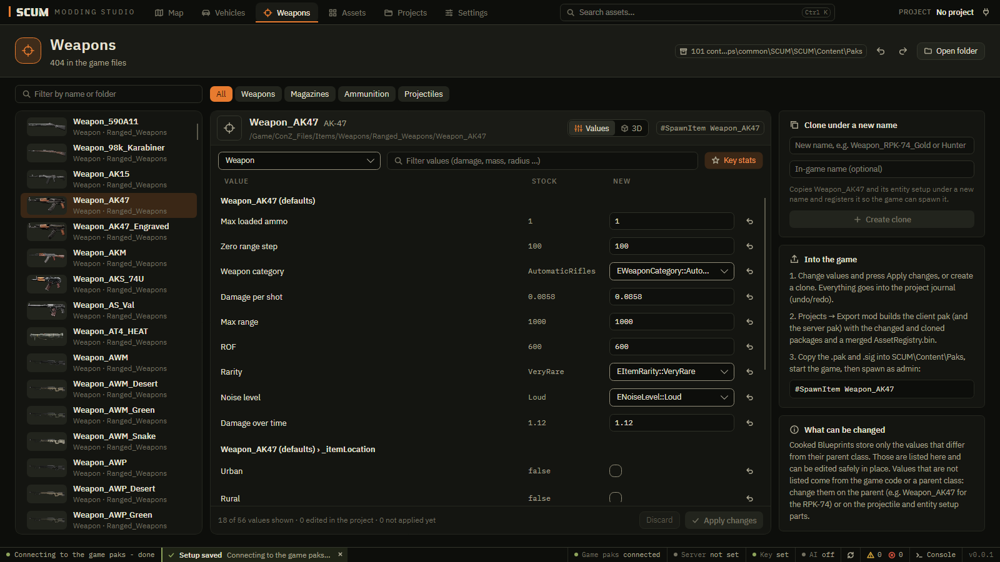
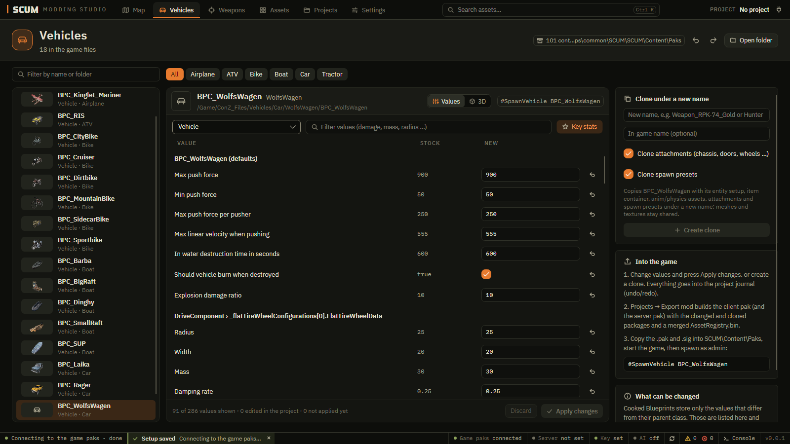
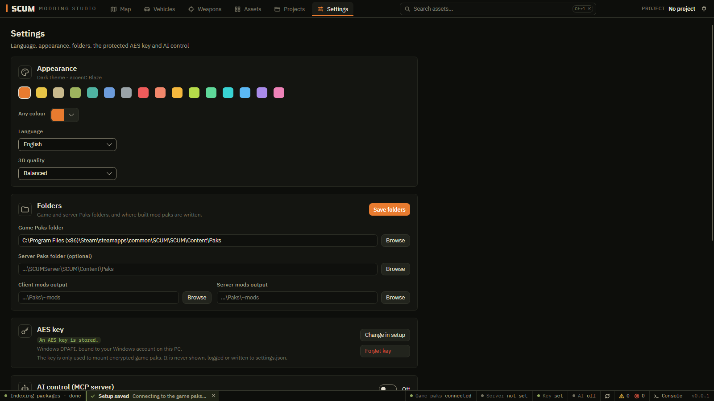
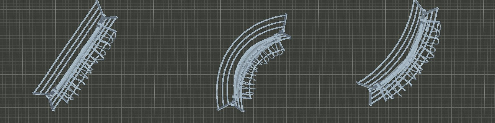

<div align="center">

# SCUM Modding Studio

**The free SCUM map editor and mod maker: edit the island in 3D, build bridges and roads, tune and clone vehicles and
weapons, and export ready-to-play mod paks for single player and dedicated servers, without the Unreal editor.**

[](https://github.com/ALLAWI32/SCUM-Modding-Studio/actions/workflows/build.yml)
[](https://github.com/ALLAWI32/SCUM-Modding-Studio/releases)
[](LICENSE)


[](https://youtu.be/rMdePE6KNnQ)

**▶ [Watch the 3-minute video guide on YouTube](https://youtu.be/rMdePE6KNnQ)**: first start, map editor, building bridges, weapons, export.

</div>

SCUM Modding Studio is a desktop tool for **SCUM modding** on Windows. It reads SCUM's cooked Unreal Engine 4.27 game
files directly, shows the map the way the game draws it, and writes your changes into a normal
`pakchunkNNN-<Name>_P.pak` mod for the client and the dedicated server. Every change is a line in a project journal:
undo anything, even after a restart, and rebuild the mod after a game update.

What you can do with it: a **SCUM map editor** (move, copy, delete and add objects, buildings, trees and rocks), a
**SCUM bridge and road builder** (bend, lengthen, weld and repeat pieces with working collision), a **SCUM vehicle and
weapon editor** (damage, rate of fire, range, mass, handling, in-game names, clones with their own names), an **asset
browser** (thumbnails, PNG and glTF export) and a **pak mod exporter** for single player and servers.

## Contents

- [Video guide](https://youtu.be/rMdePE6KNnQ)
- [Download and first start](#download-and-first-start)
- [Features](#features)
- [Screenshots](#screenshots)
- [How it works](#how-it-works)
- [Every page and button](#every-page-and-button)
- [Keyboard and mouse](#keyboard-and-mouse)
- [The AES key](#the-aes-key)
- [Command line](#command-line)
- [AI control (MCP)](#ai-control-mcp)
- [Build from source](#build-from-source)
- [FAQ](#faq)
- [Safety and fair play](#safety-and-fair-play)
- [Credits and license](#credits-and-license)

## Download and first start

1. Download `SCUM-Modding-Studio-<version>-win-x64.zip` from the
   [**Releases**](https://github.com/ALLAWI32/SCUM-Modding-Studio/releases) page and unzip it anywhere.
   No install, no .NET needed: the build is self-contained.
2. Start `ScumStudio.App.exe`. The **setup** window opens by itself the first time:
   - **Auto-detect (Steam)** finds SCUM (and the SCUM dedicated server, if you have one) in your Steam libraries.
     Or press **Browse** and pick the game's folder.
   - The **AES key** is found for you: the app looks it up online, tests it on your game files and stores it encrypted
     for your Windows account ([details](#the-aes-key)). If that fails, paste the key in the box.
   - **Save and connect**.
3. Everything is yours from there: each person points the app at their own game, nothing is shared or uploaded.

You need Windows 10 or 11 (x64), SCUM installed, and a graphics card with OpenGL 4.3 (any card from the last ten years).

## Features

| | |
|---|---|
| **3D map editor** | Fly over the whole island (levels stream in around the camera) or open one cell or sublevel. Click any object, move and turn it with the mouse, snap it to the ground or to other pieces, delete it, copy it anywhere (`Ctrl+C` / `Ctrl+V`), select every object of the same kind (`Ctrl+A`), or pick single trees and rocks. |
| **Bridges, roads and walls** | The **Shape** menu bends a wall, bridge or road piece into a curve or an S, makes it longer, wider, taller, raises a ramp or a hump, lengthens a bridge pylon's legs under the water, and welds an end onto another piece. Pieces made much longer repeat copy after copy. Bent pieces get **real collision** built from the mesh (no invisible walls, no holes), on the client and the server. |
| **Objects browser** | Every placeable object of the game in categories (buildings, furniture, nature, vehicles, items …) with thumbnails, plus building sets: all walls, all roads, all bridges. Place one in front of the camera with a click. |
| **Vehicles and weapons** | Change the stored values (damage, rate of fire, range, handling, mass, capacity, names …) or clone a vehicle or item under a new name, ready to spawn with `#SpawnItem` / `#SpawnVehicle`. |
| **Assets** | Browse all 110,000 game packages, preview meshes and textures, export textures as PNG and meshes as glTF (Blender), dump whole categories of game files. |
| **Mod export** | One click writes the client pak (and the server pak when a server is set) with an export report. It checks the collision of every shaped piece, makes the game load your additions wherever you built them, and never modifies the original game files. |
| **Automatic AES key** | The key is fetched from a public key list, tested and stored encrypted; you are asked only if that fails. |
| **8 languages** | English, العربية (Arabic), Русский, Deutsch, Español, Türkçe, Bosanski / Hrvatski / Srpski and 简体中文 (Chinese). Every control explains itself when you hover it. |
| **Your colours** | 16 accent colours plus a colour picker for any colour you like. |
| **AI control (MCP)** | Let Claude or another MCP client open levels, build villages and forests on the ground, tune items and export, while every change stays in your undo history. Local only, token protected. |
| **Command line** | `scumstudio` does everything the app does, for scripts and batch work. |

## Screenshots

**Map editor: the outpost of cell A_0 in 3D, the world tree, entities and properties**



**First start: the key is found online and tested on your files**



**Objects: every placeable object by category, with pictures**



**Assets: every game file, texture preview, PNG and glTF export**



**Weapons: stored values of the AK-47, clone box and spawn command**



**Vehicles: handling and parts of the WolfsWagen**



**Settings: language, colours, folders, key and AI control**



**The Shape menu: a real outpost wall, straight, bent 90° right and 45° left, in one piece**



<sub>All pictures are made by the app itself, offscreen (the 3D views come from its own renderer). No game files are
included in this repository.</sub>

## How it works

1. **Read.** The app mounts SCUM's `.pak` files (with the AES key) and reads the cooked packages with
   [CUE4Parse](https://github.com/FabianFG/CUE4Parse) and its own byte-exact package reader: levels, meshes, textures,
   materials, Blueprints, landscape tiles.
2. **Edit.** Everything you do (move, delete, add, copy, bend, tune a value, clone) is recorded in a **project**: a
   folder `<Name>.ssproj` with `project.json`, `journal.jsonl` (one edit per line) and `notes.md`. Undo and redo survive a
   restart; nothing in the game folder changes while you work.
3. **Export.** On export, every edited level is rewritten from the **original** game files plus your journal: actors
   removed, moved, added, bent pieces written as spline meshes with box collision, the level's streaming area grown over
   what you built. Vehicle and item edits rewrite their packages and a merged `AssetRegistry.bin`. Everything is packed
   into `pakchunk900-<Name>_P.pak` with a copy of a stock `.sig`, for the client and (from the server's own files) the
   dedicated server.
4. **Play.** Copy the pak and its `.sig` into `SCUM\Content\Paks` (the app can do it for you through the mods folders
   in Settings). After a game update, open the project and export again.

## Every page and button

### Top bar

- **Map, Vehicles, Weapons, Assets, Projects, Settings**: the pages.
- **Search** (`Ctrl+K`): searches the current page; elsewhere it searches the Assets page.
- **PROJECT**: the open project; the plug icon opens the setup.
- **Status bar** (bottom): game paks, server, key and AI state, the reconnect button, warning and error counters, and
  **Console** (`Ctrl+L`): the app's log, copyable (`Ctrl+C`, or the copy button) to share in a bug report.

### Map

- **World** tree: the island's 25 cells and ~2,300 sublevels. **Whole island** shows everything; the cell under the
  camera loads in full detail.
- Toolbar:
  - **Maximize** (`F11`) and **Pop out**: give the 3D view the whole page or its own window (second monitor).
  - **Quality**: Performance, Balanced, High or Ultra (how far and how detailed the view draws).
  - **Snap**: pieces dragged near each other join end to end, or side by side with level tops; fences stand on edges.
    Hold `Alt` to place freely.
  - **Drone** (`Tab`): fly like the in-game drone.
  - **Frame all** / **Frame selection** (`F`), **Last object** (`Backspace`).
  - **Shape**: bend, lengthen, widen, raise, resize the selection (see below).
  - **Extend** (`Ctrl+E`): lay a copy right after the selected wall, road or tunnel piece; press again to keep building.
  - **Add object**: type or paste an object path (copied from Assets) to place it in front of the camera.
- **Shape** handles in the 3D view:
  - **Blue diamonds** push the curve right or left (same way: an arc, opposite ways: an S); the **blue arrow** over each
    raises or lowers the middle (a hump or a wave).
  - **Green squares** at the ends make the piece longer or shorter; the **green arrow** raises or lowers that end (a
    ramp). Brought close to another piece's end, an end **welds** onto it (`Alt`: no weld).
  - **Red squares** at the corners make that side wider or narrower.
  - **Orange arrow** under a pylon or tower: longer legs, the top stays where it is.
  - **Straighten** puts it back.
- **Entities**: the actors of the loaded levels, with a filter; **Delete**, **Delete all…** (same mesh or same class).
- **Properties**: location, rotation and scale of the selection with **Copy**, **Duplicate** and **Apply transform**.
- **History**: the project's edits, newest first, with undo (`Ctrl+Z`) and redo (`Ctrl+Y`).
- **New project / Open project / Export mod**: top right.

### Vehicles and Weapons

- The list on the left with a filter and category chips (Weapons, Magazines, Ammunition, Projectiles; Car, Bike, Boat …).
- **Values** / **3D**: the stored values, or the model in 3D.
- The part picker (vehicle, chassis, doors, entity setup …) and **Key stats** (only gameplay values, or everything).
- **NEW** column: type a new value; the arrow resets it. **Apply changes** records the edits, **Discard** drops them.
- **Clone under a new name** (with attachments and spawn presets) and the **spawn command** to copy.
- Values that are not listed live in a parent class or the game code: the "What can be changed" box explains where.

### Assets

- **Objects** (by category, with building sets) or **All files** (by folder).
- Tiles or a compact list; the filter (`class:StaticMesh` keeps one class).
- Details of the selected package: **Export PNG**, **Export glTF**, **Place in map**, copy the object path.

### Projects

- **Create project**, **Open project**, recent projects.
- **Export mod**: mod name, output folder, also the server pak; the last export with its report.
- **Dump…**: extract whole categories of game files (weapons, vehicles, buildings, trees, sounds …) to a folder.

### Settings

- **Appearance**: 16 accent colours and **Any colour** (a full colour picker), **Language**, **3D quality**.
- **Folders**: game and server Paks folders and where built paks are copied.
- **AES key**: change it in the setup or forget it.
- **AI control (MCP server)**: on/off, port, token, copy the Claude Code command or the Claude Desktop config, install
  the Claude skill.

## Keyboard and mouse

| Key | Action |
|---|---|
| Right-drag | look around |
| `W` `A` `S` `D`, `Q` `E` | fly, down and up (`Shift` faster, wheel changes speed) |
| `Tab` | drone mode (`Esc` leaves) |
| Left click | select (`Ctrl+click` adds, `Shift+click` a whole road or forest) |
| Left-drag | move the selection (wheel turns it, `Shift`+wheel raises it) |
| `Page Up` / `Page Down` | raise or lower 1 cm (`Shift`: 10 cm) |
| `Ctrl+C` / `Ctrl+V` | copy and paste in front of the camera (also into another level) |
| `Ctrl+A` | everything of the same kind (`Ctrl+Shift+A`: the whole map) |
| `Ctrl+E` | extend the piece (`Ctrl+Shift+E` the other way) |
| `Delete` | delete the selection |
| `F` | frame the selection |
| `Backspace` | back to the last object |
| `Ctrl+Z` / `Ctrl+Y` | undo / redo |
| `F11` | maximize the 3D view |
| `Ctrl+K` | search |
| `Ctrl+L` | console |

## The AES key

SCUM's stock paks are encrypted with an AES-256 key, the same for every player. Modding tools need it to read the game.
SCUM Modding Studio finds it for you:

1. On the first start (or with **Find the key online** in the setup) it reads the public list of Unreal Engine game keys
   on [gamestranslator.it](https://www.gamestranslator.it/index.php?/forums/topic/1485-raccolta-di-chiavi-di-crittografia-aes-per-giochi-ue45/)
   and takes the key written next to "SCUM".
2. It **tests** that key on your game files and keeps it only if it opens them.
3. It stores the key encrypted for your Windows account (DPAPI, `%LOCALAPPDATA%\ScumStudio`). The key is never shown,
   logged, written to a project, sent to the AI, or part of this repository.

If the list is unreachable or the game was updated with a new key, the setup says so and you can paste the key yourself.

## Command line

```
scumstudio level list   "D:\SCUM\Content\Paks"
scumstudio level dump   "D:\SCUM\Content\Paks" A_0_Outpost
scumstudio render level "D:\SCUM\Content\Paks" A_0 -o a0.png --size 1600x900
scumstudio item list    "D:\SCUM\Content\Paks" --kind Weapon
scumstudio item stats   "D:\SCUM\Content\Paks" Weapon_RPG7 --filter Damage
scumstudio item clone   MyMod.ssproj "D:\SCUM\Content\Paks" Weapon_RPK-74 Weapon_RPK-74_Gold
scumstudio item set     MyMod.ssproj "D:\SCUM\Content\Paks" Weapon_RPG7 "Default__Weapon_RPG7_C|DamagePerShot" 4.5
scumstudio project new    MyMod.ssproj --source "D:\SCUM\Content\Paks"
scumstudio project apply  MyMod.ssproj edits.jsonl
scumstudio project export MyMod.ssproj -o out
```

The CLI reads the key the app stored; on another machine set `SCUMSTUDIO_AES_KEY` (never pass it on the command line).

## AI control (MCP)

**Settings → AI control (MCP server) → On → Copy Claude Code command.** Claude can then open levels, place objects on
the ground (stacking on roofs and floors, scattering forests), delete, move and copy actors, tune and clone vehicles and
weapons, export the mod and take screenshots to check its work. The server listens on `127.0.0.1` only, needs the
token, and never sees the AES key. Details and the security model: [docs/MCP.md](docs/MCP.md).

```
claude mcp add --transport http scumstudio http://127.0.0.1:47130/mcp --header "Authorization: Bearer <token>"
```

## Build from source

Requirements: Windows 10/11 x64, the .NET 8 SDK, a GPU with OpenGL 4.3.

```
git clone https://github.com/ALLAWI32/SCUM-Modding-Studio.git
cd SCUM-Modding-Studio
scripts\build.ps1 -Configuration Release -Test        # build + tests (game-data tests skip without the data)
scripts\build.ps1 -Publish -Zip                       # self-contained app + CLI in dist\ (and the release zip)
```

Visual Studio 2022: open `ScumStudio.sln` and set `ScumStudio.App` as the startup project. More in
[docs/BUILDING.md](docs/BUILDING.md).

| Project | What it does |
|---|---|
| `ScumStudio.Formats` | cooked package reader/writer (byte-exact round trips), tagged properties, World Composition tile info |
| `ScumStudio.Pak` | pak v11 reader/writer |
| `ScumStudio.Assets` | catalogue, meshes, textures, materials, collision (via CUE4Parse) |
| `ScumStudio.Level` | level model, edit journal, shapes and collision of bent pieces, exporter |
| `ScumStudio.Modding` | vehicle/item tuning and cloning |
| `ScumStudio.Rendering` / `ScumStudio.Viewport` | OpenGL 4.3 renderer, level scenes, terrain |
| `ScumStudio.App` | Avalonia desktop app |
| `ScumStudio.Cli` / `ScumStudio.Mcp` | command line and MCP server |

## FAQ

**Does it work on official servers?** Mods only load where the server runs them: your own single player game, your own
dedicated server, or community servers that use mods. Use mods where they are allowed.

**My bridge has no collision / vanished when I walked on it.** Export again with the current version: bent pieces get
their collision built in, and the export makes the game keep the level loaded wherever you built.

**The game was updated and my mod broke.** Open the project and press **Export mod** again: every export starts from the
current game files.

**The key could not be found.** Paste it in the setup's key box; the app tests it before storing it.

**Where are my projects?** In `Documents\ScumStudio Projects` unless you chose another folder.

## Safety and fair play

- SCUM Modding Studio only reads the game's files and writes mod paks. It never touches the running game, never patches
  `SCUM.exe` or `SCUMServer.exe`, never forges pak signatures (it copies a stock `.sig`), and has no speed, movement or
  combat cheats.
- No game files, keys or extracted assets are in this repository or in a release.
- Use your mods on servers that allow them, and respect the game's terms.

## Contributing

Bug reports, ideas and pull requests are welcome: read [CONTRIBUTING.md](CONTRIBUTING.md) first. Security issues:
[SECURITY.md](SECURITY.md). Changes per version: [CHANGELOG.md](CHANGELOG.md).

## Credits and license

Made by **ALLAWI**. Built on [CUE4Parse](https://github.com/FabianFG/CUE4Parse), [Avalonia](https://avaloniaui.net/),
[Silk.NET](https://github.com/dotnet/Silk.NET) and more; see [THIRD-PARTY-NOTICES.md](THIRD-PARTY-NOTICES.md).

Released under the [MIT License](LICENSE).

SCUM Modding Studio is a fan-made tool. It is not affiliated with or endorsed by Gamepires or Jagex. SCUM is a trademark
of its owners; all game content belongs to them.

<sub>Keywords: SCUM mod, SCUM modding tool, SCUM map editor, SCUM mod maker, SCUM pak, SCUM server mods, SCUM bridge
builder, SCUM vehicle editor, SCUM weapon editor, SCUM AES key, Unreal Engine 4.27 pak modding, UE4 cooked asset editor.</sub>
